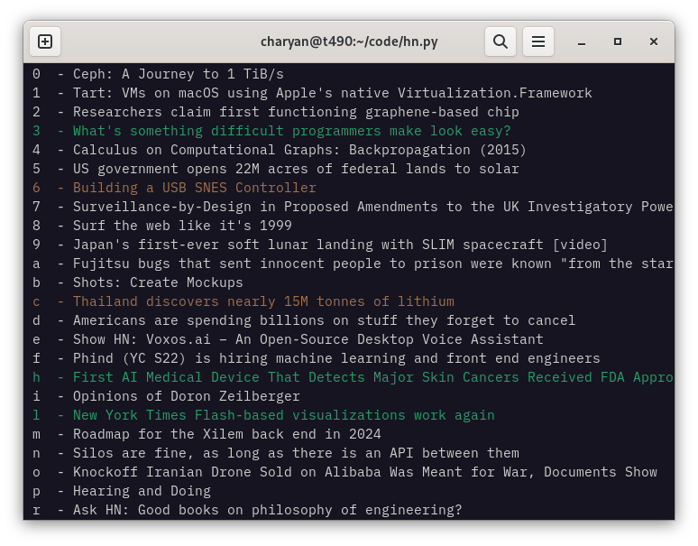

# Hacker News Daily Scraper



This script scraps the front page of Hacker News with `requests`, extracts the links with `BeautifulSoup`, then show the user a simple menu with `curses` to select what links to open, and then open them in Firefox. It keeps a timestamp of the last time the script was opened in `~/.hacker_news` to let it be used only once a day.

```
usage: hn.py [options]

Hacker News Daily

options:
  -h, --help  show this help message and exit

Scraps the front page of Hacker News and let you choose which links to open in firefox.
Use the keys j/k/g/G/SPACE to navigate and press ENTER/q to open the links in firefox.
Select the links with the keys 0-9/a-z. A green link will open the site, a yellow one the comments.
The software can only be used once a day. It will save the last time you used it in ~/.hacker_news.
```

## Usage
```
pip install bs4
python hn.py
```